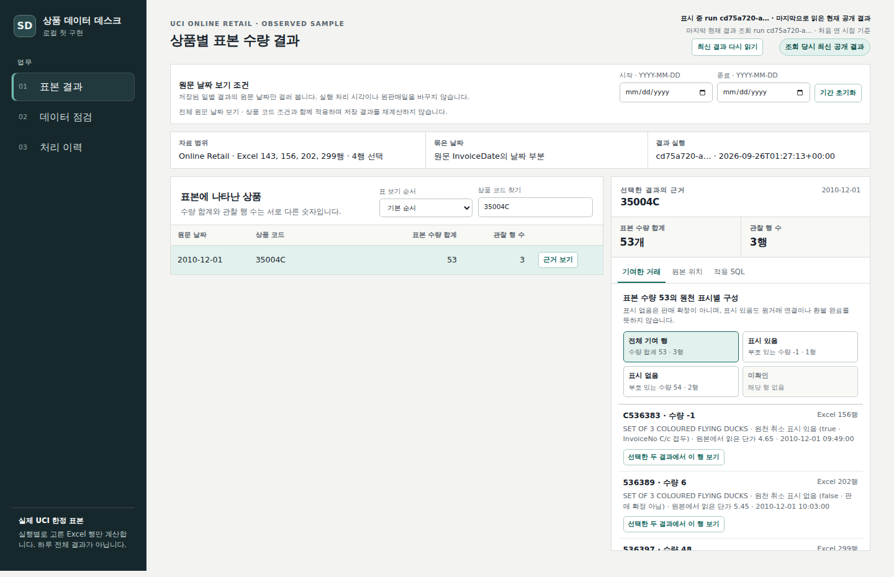
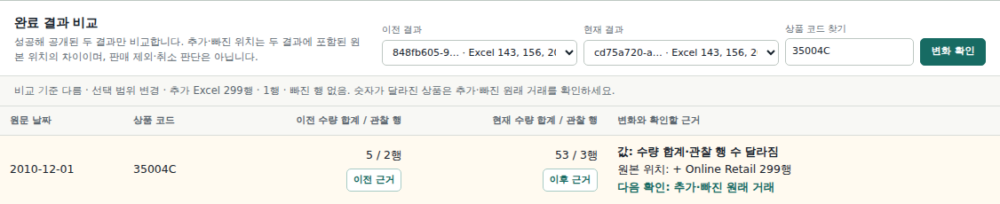
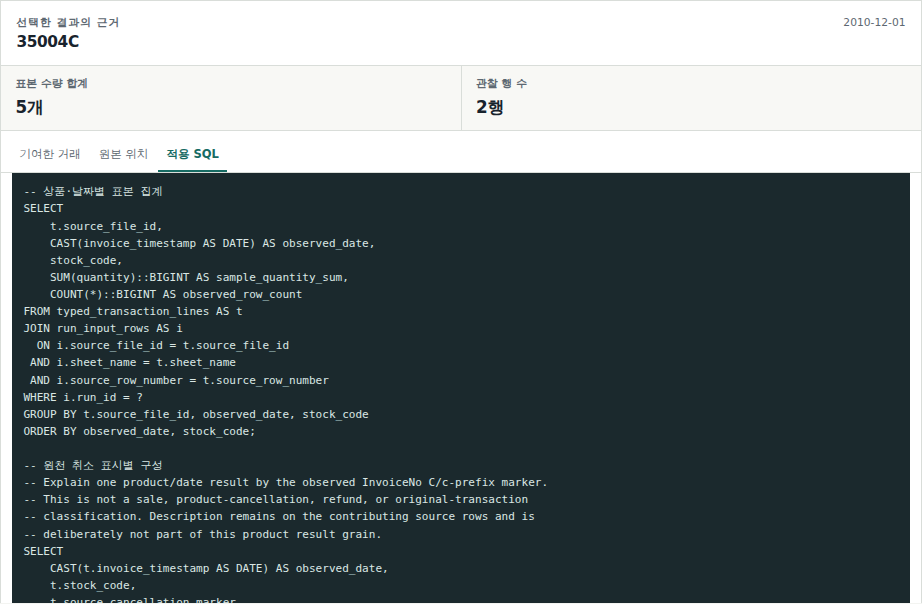

# Shopping Data Platform

쇼핑 거래 자료를 상품·날짜별 현황으로 만들고, 그 결과를 만든 처리 과정까지 확인하는 데이터 플랫폼 프로젝트입니다. 상품 운영 담당자는 관심 상품의 현황과 변화를 살펴보고, 데이터 담당자는 계산에 사용한 자료와 규칙을 찾아 문제가 생긴 지점을 확인할 수 있도록 합니다.

거래 자료를 받아 원본을 보존하고, 값을 검증·변환해 집계한 뒤 조회 화면으로 제공합니다. 각 실행의 입력과 계산 결과를 남겨 재처리 전후를 비교하고, 새 계산이 실패하면 마지막 정상 결과를 유지합니다. 이처럼 자료 수집부터 결과 제공과 복구까지 이어지는 시스템을 만들며 데이터 엔지니어링을 배우는 것이 프로젝트의 목적입니다.

현재는 공개 UCI Excel의 선택한 거래를 Python과 DuckDB로 처리하는 로컬 파이프라인과 웹 탐색 화면을 구현했습니다. 상품별 **표본 수량 합계**, 데이터 점검, 처리 이력을 볼 수 있습니다. 스트리밍 처리는 합성 이벤트를 사용하는 [별도 Kafka 실험](#실제-kafka-재전달-실험)으로 다룹니다.



상품 현황에서 숫자를 고르면 오른쪽에서 계산에 들어간 거래와 SQL을 확인합니다.

세 화면은 결과를 읽는 일과 처리 과정을 확인하는 일을 연결합니다.

- **상품 조회:** 상품 코드와 날짜 범위로 결과를 좁히고, 수량을 만든 거래를 읽습니다.
- **데이터 점검:** 입력 자료와 처리 상태를 확인하고, 실패가 있으면 실행 이력으로 찾아갑니다.
- **처리 이력:** 이전 계산과 새 계산의 값·입력 범위·규칙을 비교하고, 각 결과에 저장된 근거를 다시 엽니다.

<a id="실행"></a>
## 시작하기

Linux 또는 WSL2와 Python 3.10 이상이 필요합니다. 파일 잠금과 프로세스 종료 검사는 Linux 기능을 사용합니다.

```bash
git clone https://github.com/junhyun-dev/shopping-data-platform.git
cd shopping-data-platform
git switch --track origin/feature/uci-sample-first-slice
python3 -m venv .venv
. .venv/bin/activate
python -m pip install "duckdb==1.4.4" "openpyxl==3.1.5" "pytz==2025.2" "pytest>=9,<10>"
```

[UCI 공식 다운로드](https://archive.ics.uci.edu/static/public/352/online%2Bretail.zip)에서 ZIP을 받아 `Online Retail.xlsx`를 `data/source/Online Retail.xlsx`에 넣습니다. 원본 파일은 저장소에 포함되어 있지 않습니다.

```bash
mkdir -p data/source
# 내려받은 Online Retail.xlsx를 위 폴더에 넣습니다.
python -m shopping_data run
python -m shopping_data serve
```

브라우저에서 <http://127.0.0.1:8765>를 엽니다. 기본 실행은 Excel의 8개 행만 읽습니다. 상품 `85123A`의 **근거 보기**를 누르면 수량 `6`을 만든 한 행과 적용 SQL을 확인할 수 있습니다. 실행 전에 [설정 파일](config/source.json)의 SHA-256으로 원본이 예상한 파일인지 검사합니다.

서버를 종료할 때는 `Ctrl-C`를 누릅니다. 다음에는 `serve` 명령만 실행하면 저장된 결과를 다시 볼 수 있습니다. `run`은 새 계산을 만들 때 사용합니다.

<a id="interactive-demo"></a><a id="숫자가-바뀐-이유-살펴보기"></a><a id="실제-5--53-비교를-처음-준비하고-다시-열기"></a><a id="기존-실행-결과를-브라우저에서-비교하기"></a><a id="상품-결과에서-원천-표시별-기여-행-읽기"></a>
## 직접 사용하기: 숫자가 바뀐 이유 살펴보기

[두 결과를 준비하는 실행 예](docs/guide.md#comparison-demo)는 기본 DB와 별도의 폴더를 사용합니다. UCI 파일의 네 행에서 선택 범위를 달리해 같은 상품의 수량이 `5`에서 `53`으로 바뀌는 예를 만듭니다. 새로 포함된 수량 `48`이 어디에서 왔는지 다음 순서로 살펴봅니다.

1. **현재 수량의 근거를 봅니다.** 상품 `35004C`를 검색하고 **근거 보기**를 누릅니다. 위 화면의 `53`에는 수량 `-1`, `6`, `48`인 세 행이 들어 있습니다. 기여한 거래에서 원본의 행번호와 수량을 읽습니다.

2. **이전 계산과 비교합니다.** **처리 이력**에서 두 결과를 선택하고 **변화 확인**을 누릅니다. 수량이 `5 / 2행`에서 `53 / 3행`으로 바뀌었고, Excel 299행이 추가됐다는 것을 확인합니다.

   

3. **그때 사용한 SQL을 엽니다.** 비교표의 **이전 근거**를 누르고 **적용 SQL** 탭에서 집계 부분으로 내려갑니다. 이전 수량 `5`를 만들 때 저장한 쿼리를 읽은 뒤 **비교로 돌아가기**로 같은 두 결과에 돌아옵니다. [집계 SQL 코드](sql/sample_product_daily.sql)에서도 실행별 선택 행을 어떻게 더하는지 볼 수 있습니다.

   

이 예에서 숫자가 바뀐 이유는 선택한 행이 늘었기 때문입니다. 새로운 판매가 발생했다는 뜻은 아닙니다.

<a id="date-reopen-demo"></a><a id="작은-날짜-표본으로-기간-선택과-재열기"></a><a id="원문-날짜-구간으로-결과-보기"></a><a id="같은-저장-실행과-보기-조건으로-다시-열기"></a>
## 관심 상품과 기간으로 다시 열기

상품 코드와 원문 날짜 범위로 목록을 좁히고 수량순으로 정렬할 수 있습니다. 숫자를 선택하면 주소에 그 계산 결과와 보기 조건이 남습니다. 주소를 새 탭에서 열어도 같은 결과의 근거를 볼 수 있고, **최신 결과 다시 읽기**를 눌렀을 때만 새 결과로 이동합니다.

[세 행으로 따라 하는 날짜 표본](docs/guide.md#date-demo)은 12월 1일 수량 `2`, 12월 2일 수량 `10`을 만듭니다. 기간을 좁혀 숫자를 열고, 주소를 복사해 다시 여는 것까지 확인할 수 있습니다. 주소가 가리키는 DB와 결과 파일은 같은 로컬 환경에 있어야 합니다.

<a id="reading-path"></a><a id="지금-실제로-이어지는-경로"></a><a id="화면의-질문에서-코드를-읽는-순서"></a>
## 주요 설계와 코드

### 받은 원본과 계산에 쓴 행을 나눴습니다

같은 파일을 여러 번 처리하더라도 원본을 매번 추가하지 않습니다. 파일 지문·시트·행번호로 원본 위치를 식별하고, 각 실행이 선택한 행은 따로 기록합니다. 따라서 원본을 남겨 둔 채 계산 범위를 바꿀 수 있고, 과거 실행의 행이 새 합계에 섞이지 않습니다.

[테이블 정의](sql/schema.sql)의 `source_rows`와 `run_input_rows`를 읽은 뒤, [집계 SQL](sql/sample_product_daily.sql)이 실행 ID로 범위를 고르는 부분을 보면 됩니다. [기여 행 SQL](sql/contribution_rows.sql)은 같은 범위의 상세를 한 번에 읽어 각 숫자의 근거를 만듭니다.

<a id="실제-프로세스-중단과-복구"></a>
### 새 계산이 실패해도 이전 결과를 보여 줍니다

[파이프라인](shopping_data/pipeline.py)은 상세 자료와 실행별 행 연결을 하나의 DB 트랜잭션에 저장합니다. 결과 JSON까지 만들어진 성공 실행만 화면의 현재 결과가 됩니다. 중간에 실패하면 이전 정상 결과를 유지하고 실패 이력을 남깁니다.

프로세스를 강제로 종료하는 검사에서도 이 동작을 확인했습니다. 다만 별도 프로세스가 DuckDB에 쓰는 동안에는 화면 조회가 실패할 수 있습니다. 현재 보장은 처리 중 무중단 조회가 아니라, 실패한 계산으로 정상 결과를 덮지 않는 것입니다. [복구 방식과 검사 범위](docs/guide.md#recovery)에 자세히 설명했습니다.

<a id="상품-묶음이-늘어날-때-기여-행을-읽는-방법"></a>
### 적재 속도를 바꾸면서 메모리 문제도 고쳤습니다

처음에는 Python에서 DuckDB로 행을 반복해서 전달하는 데 처리 시간 대부분을 썼습니다. JSON으로 한 번에 전달하도록 바꾸자 작은 표본에서는 빨라졌지만, 첫 10,000행 실행은 메모리가 크게 늘며 결과를 만들기 전에 종료됐습니다.

이후 JSON 배열을 임시 테이블에 한 번만 펼치고 각 행을 검사하도록 수정했습니다. 수정한 코드에서는 자원을 제한한 로컬 10,000행 실행이 끝났고, 4,553개 상품·날짜 합계와 모든 기여 행이 별도 Python 계산과 일치했습니다. 이 결과는 운영 성능이나 더 큰 입력의 안전성을 보장하지 않습니다.

[파이프라인](shopping_data/pipeline.py)의 `_stage_source_rows_from_json`과 `_persist_staged_source_rows`가 해당 코드입니다. [측정 조건과 수정 과정](docs/guide.md#loading)은 상세 문서에 남겼습니다.

### 주소에는 보기 조건뿐 아니라 계산 결과도 고정했습니다

검색어와 기간만 저장하면 같은 주소를 열어도 새 계산 이후에는 다른 숫자가 나올 수 있습니다. 그래서 주소에 성공한 실행 ID를 함께 넣었습니다. 없는 결과나 잘못된 주소를 열었을 때는 최신 숫자로 대신하지 않고 오류를 보여 줍니다.

[화면 코드](web/app.js)의 `parseInitialViewQuery`, `loadPinnedResult`, `restoreResultContextParent`에서 주소 해석과 과거 근거를 본 뒤 돌아오는 방식을 읽을 수 있습니다. [서버](shopping_data/server.py)는 DB에 등록된 성공 결과만 제공합니다.

## 다음 발전 방향

현재 파일 처리 흐름을 바탕으로, 실제 업무에 사용할 판매·취소 지표의 정의와 늦게 도착하거나 정정된 자료의 반영 방식을 검토하려 합니다. 입력 규모에 따른 처리 비용과 메모리 사용, 반복 실행과 실패를 관리하는 운영 방식도 비교할 주제입니다. 후속 엔진이나 운영 환경을 확정한 로드맵은 아니며, 각 문제의 자료와 실험 결과를 보고 선택하려 합니다.

<a id="검증"></a>
## 검사

```bash
pytest -q tests/test_pipeline.py tests/test_source_meaning.py
python tools/independent_check.py
```

테스트는 같은 파일의 반복 처리, 다른 실행의 행이 섞이지 않는지, 잘못된 수량과 입력, 중간 실패와 프로세스 종료 후 복구를 확인합니다. 원본 파일을 읽는 검사는 파일이 없으면 건너뜁니다. `independent_check.py`는 원본을 openpyxl로 읽어 계산한 값을 출력하며, 실제 원본을 사용하는 테스트가 이를 SQL 결과와 비교합니다.

브라우저에서는 상품과 기간 선택, 이전 결과 탐색, 잘못된 주소, 조회 실패, 재열기와 모바일 배치를 별도로 확인했습니다. 이 브라우저 검사들은 아직 저장소에서 한 명령으로 반복할 수 있는 테스트로 정리되지 않았습니다. 다음 개선 후보입니다.

<a id="실제-kafka-재전달-실험"></a>
## 별도 Kafka 실험

같은 저장소에 합성 이벤트를 사용하는 Kafka 실험도 있습니다. 소비 프로그램이 결과를 저장한 뒤 Kafka에 읽은 위치를 기록하기 전에 멈추면, 다시 받은 이벤트로 합계가 늘어나는지 확인하는 실험입니다. 최종 값은 별도의 배치 계산과 비교합니다.

UCI 화면을 실시간화한 기능은 아닙니다. 단일 broker·partition·consumer에서 프로세스 종료와 재전달을 확인했으며, 외부 DB와 Kafka를 하나의 트랜잭션으로 묶는 exactly-once 보장이나 고가용성 검증은 하지 않았습니다. [입력과 실행 절차](docs/guide.md#kafka)를 따로 정리했습니다.

<a id="같은-음수-수량을-원천-표시별로-관찰하기"></a><a id="같은-c표시-음수의-날짜는-어디에-둘까"></a><a id="아직-구현하지-않은-것"></a><a id="데이터-출처와-공개-범위"></a>
## 데이터와 현재 범위

화면의 **표본 수량 합계**는 선택한 거래의 `Quantity`를 부호 그대로 더한 값입니다. 판매량·순매출·환불액으로 해석할 수 있는 지표는 아직 정의하지 않았습니다.

원천은 Chen, D. (2015)의 [Online Retail](https://doi.org/10.24432/C5BW33)입니다. UCI는 데이터를 [CC BY 4.0](https://creativecommons.org/licenses/by/4.0/)으로 제공합니다. 테스트에는 원천 일부에서 고객 식별자를 `TEST-CUSTOMER`로 바꾼 자료와 합성 반례를 사용하며, 원천에서 유래한 부분에는 같은 출처와 라이선스가 적용됩니다.

로컬 원본과 DB에는 `CustomerID`가 남을 수 있지만 결과 JSON과 화면에는 제공하지 않습니다. 원본 Excel, DB, 실행 결과, 인증 정보와 회사 자료는 공개 저장소에서 제외합니다. 프로젝트 **코드의 재사용 라이선스는 아직 지정하지 않았습니다.**

이 프로젝트는 로컬에서 실행하는 학습용 서비스입니다. 전체 데이터 품질 검토, 판매·취소의 원거래 연결, 영업일과 금액 계산 규칙, 운영 배포는 앞으로 결정할 부분입니다. 화면의 원천 취소 표시는 청구번호의 `C` 접두를 읽은 것으로, 환불 완료를 뜻하지 않습니다. [표시와 수량을 읽는 기준](docs/guide.md#data-meaning)을 참고할 수 있습니다.

<a id="구현도움검토-범위"></a>
## 작성에 사용한 도구

Python·SQL·화면 코드와 문서 작성에는 Codex AI의 도움을 받았고, 구현과 검토 역할을 나누어 코드·독립 계산·실제 화면을 대조했습니다. 이 과정의 AI 검토를 사람의 코드 리뷰나 실제 운영 경험으로 소개하지는 않습니다. DuckDB, openpyxl, Apache Kafka, confluent-kafka는 기존 오픈소스를 사용합니다. Metabase와 Databricks 공식 문서는 분석 화면과 실행 상태를 탐색하는 방식의 참고 자료로 사용했습니다.

## 질문과 문제 제보

[junhyun-dev](https://github.com/junhyun-dev)가 관리하는 개인 학습 프로젝트입니다. 실행이 안 되거나 숫자를 설명하기 어려운 부분은 [GitHub Issues](https://github.com/junhyun-dev/shopping-data-platform/issues)에 실행 명령, 기대한 결과와 실제 결과를 알려 주세요. 원본 거래 파일이나 고객 정보 대신 공개 예제의 행번호와 오류 메시지를 사용해 주세요.
